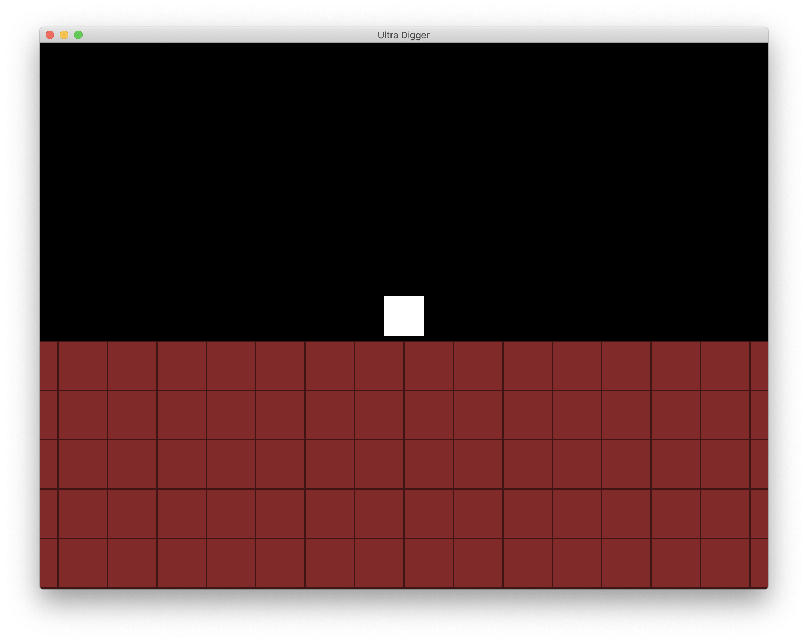
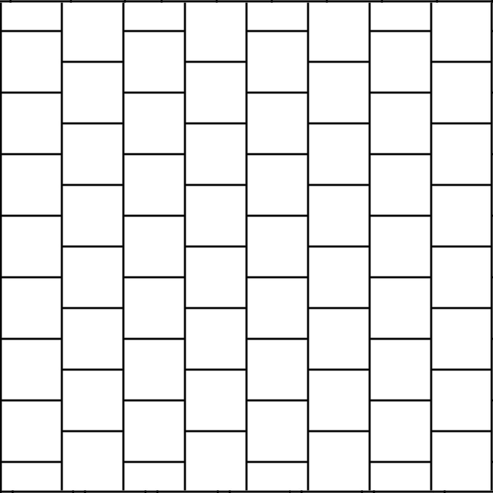

# Ultra Digger

Game Jam: May 1-3, 2020

Web version: [Ultra Digger](https://runegate.com/GameJams/UltraDigger/)

## Building

1. Install [Rogue](https://github.com/AbePralle/Rogue).
2. Run `rogo macos` in this project's root folder.
3. Re-run `rogo macos` (as instructed) after dependency installation.
4. Run `rogo macos open` to open Xcode project. Run.

## Development Journal

## May 1, 2020
### 9:34 am
> I'm a big fan of mining games like Gem Miner and Motherload. Probably my all-time favorite is Super Digger which was Super Motherload-inspired and was only available on Windows Phone (RIP :cry: ). So I'm gonna start from scratch on a Super Digger-inspired game!

### 6:51 pm
Started on game

### 8:44 pm
> [In the style of Doctor Weird] Gentlemen, behold! My first game screen:

## May 2, 2020
### 1:43 am
> The movement is feeling really good! The digging doesn't always work right and is a total kludge, but I'll redo that aspect.

[Journal/Ultra_Digger_Movement.mp4](Journal/Ultra_Digger_Movement.mp4)

> I divide the total velocity into a number of steps no larger than the size of the digger. My original plan was to do a binary search for a safe space if a collision happened along the way, but then I had a big "ah-ha" moment: since it's all orthogonal I can just set the digger position to be at the near or far edge of the tile it's already in.
> Also I recommend not naming a frequently-used variable "digger" unless you want to be accidentally typing "dagger" all the time haha.

### 2:08 pm

[Ultra_Digger_Digging.mp4](Journal/Ultra_Digger_Digging.mp4)

### 9:06 pm
> As part of my random map generation I want to include natural chasms sprinkled underground. IMO this increases the experience of exploration as you run across paths of lesser resistance that might also reveal a cluster of gems or whatever (BTW there will be a fog of war effect where you can't see past walls into unexplored areas). I was thinking of some more complex algorithms but decided to try a really simple one and the simple one ended up working out well! I just make a pass through all the tiles, skipping ahead a random N..M tiles each time. I dig a hole 4 tiles long in a random direction, with each spot having a 25% chance to branch off left and/or right (each branch finishes off a length-4 path on its own). I'll prolly tweak it some more but it's feeling pretty good already. Here's a video of the mechanism I made to try out different values - I can adjust Left & Right % chance, path length, and then it  generates a new maze.

[Ultra_Digger_Openings.mp4](Journal/Ultra_Digger_Openings.mp4)

## May 3, 2020
### 8:02 pm
> Finished a gem cluster placement algorithm that I'm pretty happy with! I wanted the cluster frequency to be fairly consistent while not seeming too regular. I ended up with another simple solution: I just picked a random tile in each (approximately) 10x10 plot of tiles and placed a gem cluster there - but for a little aesthetic boost I shifted every odd plot down by half a plot so that the plots are effectively hexagonal in their layout, similar to this:

> Here's how it's looking:

### 10:20 pm
> Ultra Digger permanent public repo: [https://github.com/AbePralle/GameJams](https://github.com/AbePralle/GameJams)

